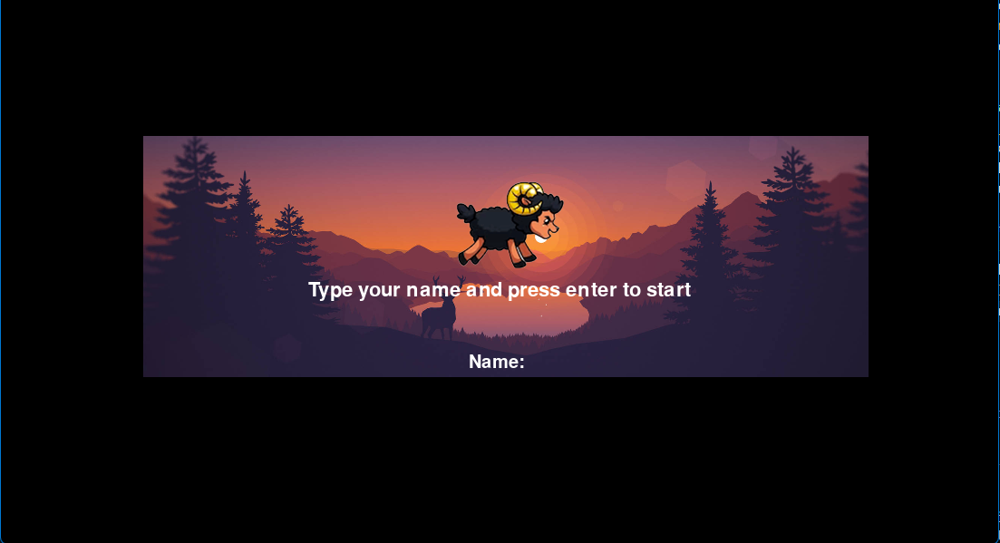
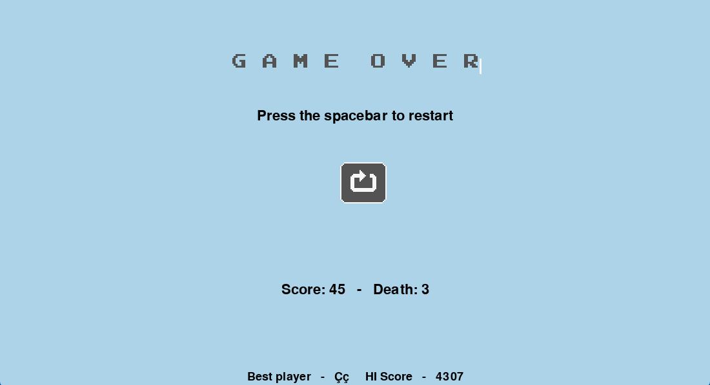

# GoatRun

## 1. About the project
<p>GoatRun is an endless runner game developed in Python for the admission process at Jala University.</p>
<p>The development of the game utilized the concept of object-oriented programming.</p>

## 2. Clone the project
Open your terminal, choose the folder of your preference, and paste the following command to clone this repository:
````
git clone git clone https://github.com/ferreira-leonardo/BR-2023-M2-T2.git
````

Enter the repository folder using the following command:
````
cd BR-2023-M2-T2
````

Open the project in VS Code using the following command:
````
code .
````

## 3. Technologies used in the project.
<ul>
  <li>Python</li>
  <li>PyGame</li>
</ul>

## 4. Media




## 5. Project author 
<a href="https://www.linkedin.com/in/leonardoferreiralima/">Leonardo Ferreira</a>
